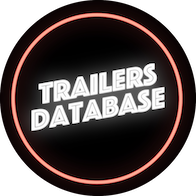

# Projects

###  [droidDevNews](https://play.google.com/store/apps/details?id=com.jacobzmidzinski.droiddevnews)

The idea behind droidDevNews is to create a place for Android Developers, where they can find interesting articles, podcasts and videos, curated by other developers.

So, basicly droidDevNews is Android developer hub with news and events 👨🏼‍💻(currently I'm working on Android version on the app, but I also plan to develop iOS version).

App is already released on Google Play - feel free to use it! 🧑🏼‍🚀

### [droidDevNews - database](https://github.com/jacobzmidzinski/droidDevNews-database)

droidDevNews-database is open source project, where community can contribute by curating content to app or by proposing changes. It's a supplement project to mobile app.

##

###  [Trailers Database](https://apps.apple.com/pl/app/trailers-database/id1393732085)

iOS app that lets you watch latest Movie and TV Show trailers.Now, also in Dark Mode! 🌗